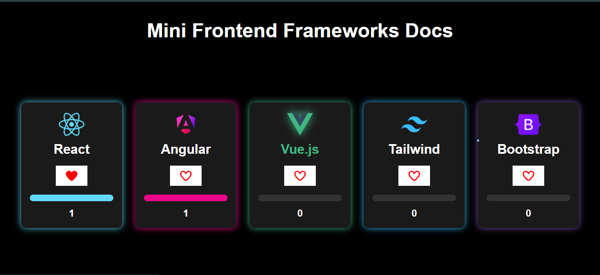

# Mini Frontend Frameworks Docs

This project is a small frontend frameworks showcase and documentation website. I created seperate pages for React, Angular, Vue.js, Tailwind CSS, and Bootstrap, where each page includes an introduction basic information and code example for the framework.

On the homepage all the frameworks are displayed as cards and users can vote for their favorite one using a like button. The voting system uses localStorage so the votes stay saved even after reloading the page and each person gives only one vote and each card also has a progress bar and number count that visually shows how many votes each framework has received.

## Built with
- HTML
- CSS
- JavaScript

## Screenshot
 